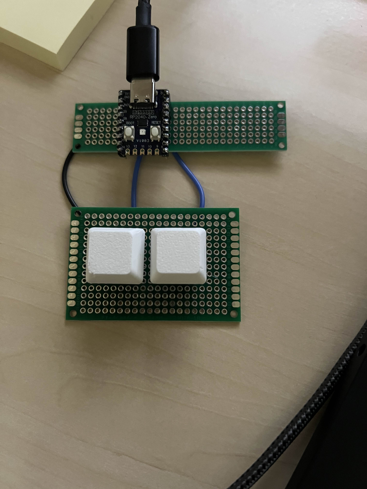

# OsuKeypad

A 2-key USB keypad for osu!, built on an RP2040-Zero and written in MicroPython. It shows up on the computer as a normal USB keyboard and types Z and X, which are osu!'s default keys.

## Hardware
- RP2040-Zero
- 2 buttons on GPIO0 and GPIO1, each wired to ground (the board's internal pull-up resistors hold the pins high until a button is pressed)

## How it works
1. The board checks both buttons about once every millisecond.
2. If either button changed (pressed or released), it sends a keystroke to the computer over USB.
3. It only sends when something changed, so it doesn't flood the computer with the same keystroke.
4. It waits for the previous keystroke to finish sending before sending the next one.

## Files
- `main.py`: the keypad firmware
- `latency_test.py`: the same code, plus a timer around `send_keys()` to measure how long sending takes

## Measuring latency
The `latency_test.py` measures the time of `send_keys()` every time a button is pressed or released and prints min, max, and average.

To run it, copy it onto the board as `main.py`, open PuTTY on the keypad's COM port at 115200, and press the keys until it prints.

Results (20 samples, about 10 presses, since a press and a release each count as one sample):

    samples: 20
    min: 487 us
    max: 578 us
    avg: 501.55 us

So the firmware takes about 0.5 ms to hand a keystroke to USB, and it's consistent (only about 90 us between the fastest and slowest).

### What this number doesn't cover
0.5 ms is only the firmware's part, not the full delay from pressing a key to the game seeing it. Two other things add to it:
- **My loop:** it checks the buttons every 1 ms, so a press can wait up to about 1 ms before the board notices it.
- **USB polling:** a USB keyboard can't push data to the computer. The computer asks the keyboard for its latest keystroke at a fixed interval, and the keystroke sits ready until the computer checks again. MicroPython's HID class asks for an 8 ms interval by default (125 Hz), so a keystroke can wait up to 8 ms on top of the firmware time. That's a lot more than the 0.5 ms I measured.

## Planned: remapping GUI
I want a PyQt6 app that pops up when the keypad is plugged in and lets you choose which key each button types, without reflashing the board.

## To do
- [ ] Remapping GUI
- [ ] Measure full press-to-screen latency (high-frame-rate video, compared against a normal keyboard)
- [ ] Rerun the latency test with 200 samples
- [ ] Make a PCB (make it look cleaner and have leds maybe) and have maybe hot swappable switches
- [ ] Make a 3D Case for the PCB

## Video of me playing osu!

